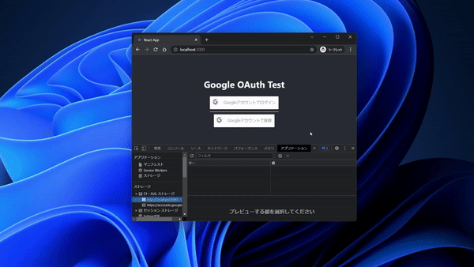
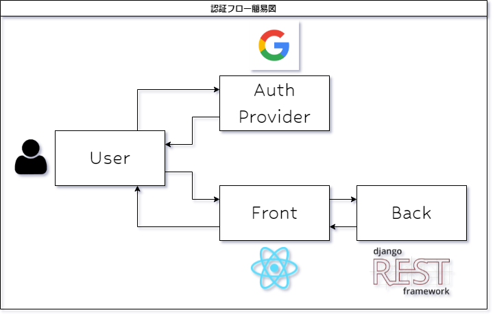

# 【絶対にできる！】Googleログインボタンの実装【React × Django REST Framework】

React × Django REST Framework で Googleログインボタンを実装するチュートリアルです

ソーシャルログインボタンの具体的な作例を通じて、サードパーティ認証(OIDC)に関して理解を深めることができます

この記事は導入偏です  
本篇は[こちら(part1)](./part1.md)から

## はじめに

こんにちは  
クラウドエンジニアをやっているcokemaniaです

ここ最近、個人WEBアプリ開発にて認証機能に`ソーシャルログイン`を使ってみたいと思い  
Googleログインボタンの作り方を調べておりました

しかし、見つかった記事は**ボタンの作成&トークンの発行で終わっている**ものしかなく  
`ユーザの新規登録`や`ログイン`機能の実装まで解説してくれているものはなかったので  
誰もがGoogleユーザ登録とログインの機能を作れるようになればと思い記事に起こしてみました

僕は普段 AWSやGCPなどのクラウドインフラばかり触っているので  
**プログラミング言語(Python, JavaScript)の知識は乏しい**です  
こんな僕でも動くものを作ることが出来たので  
初学者の方でも是非参考にしてみてください

## この記事について

本記事は フロントに`React(JavaSctipt)` バックエンドに`Django(Python)`を利用したアプリケーションの認証に  
`react-google-login`によって提供されているGoogleログインボタンを利用するデモアプリを作成していきます

デモアプリの構築を通じて`react-google-login(JavaScript React)`や`python-social-auth(Python Django)`の仕様だけでなく  
`認証周りの知識(JWTやOIDC)`などの理解も深めることができると思います

このパートを除いて**全6パート分**あり、めちゃくちゃ長いですので  
実践してみる際はお時間あるときにどうぞ

## 目標

下記内容の達成を目標とします  
つまり デモアプリの仕様です

1. `新規登録/ログイン ボタン`を配置&`新規登録/ログイン機能`を持たせる
2. 新規登録時、`Googleに登録されているユーザ情報`を取得して、デモアプリのDBに保存する(ユーザ名,email,アイコン画像URL)
3. Googleログインによって発行される`tokenを利用して認証を行い DBからユーザデータを取得する`
4. 新規登録/ログイン実施後に取得したユーザデータを画面に表示させる

かなり簡略化してますが、構成図は以下の通りです

## 前提知識

下記の知識があると本記事は理解しやすいと思います  
というか僕の実施した知識習得内容が以下の通りです

- React JS に対する最低限の知識
  - 教本1冊
  - [公式チュートリアル](https://ja.reactjs.org/tutorial/tutorial.html)実施済み
- Python に対する最低限の知識
  - [Python入門](https://python.keicode.com/lang/)
- Django に対する最低限の知識
  - 教本1冊
  - [django bros](https://djangobrothers.com/)
- DjangoRESTFrameworkに対する最低限の知識
  - [公式チュートリアル](https://www.django-rest-framework.org/tutorial/1-serialization/)1週

## 環境

本記事のデモアプリは下記の環境で構築しました

- Google Compute Engine
  - Rocky Linux 8.4
- VSCode + RemoteSSHプラグイン

## ミドルウェアバージョン

### バックエンド

| Name                | Version |
| ------------------- | ------- |
| Django              | 3.2.11  |
| djangorestframework | 3.13.1  |
| django-cors-headers | 3.10.1  |
| drf-social-oauth2   | 1.2.1   |
| python-decouple     | 3.5     |

### フロントエンド

| Name | Version |
| ---- | ------- |
| node | 17.4.0  |
| npm  | 8.3.1   |

## リポジトリ

↓デモアプリのソースコードをこちらのリポジトリで公開しております

[google-oauth-sample - cokemaniaIIDX](https://github.com/cokemaniaIIDX/google-oauth-sample)

`howto/`ディレクトリ配下に記事のmdファイルも格納しております

[→part1へ](./part1.md)