# 【絶対にできる！】Googleログインボタンの実装【1/6】

本記事は、React × DjangoRESTFramework で Googleログインボタン を実装するチュートリアル  
全6partのうちのpart1です  
part0(導入偏)は[こちら](./part0.md)

# Part1. Google認証情報作成

## 0. 流れの理解

このパートの流れは以下の通りです

1. GoogleCloud でプロジェクト作成
2. OAuth同意画面の設定
3. DjangoアプリとGoogleCloudプロジェクトを結びつける認証情報の作成

## 1. Google Cloud でプロジェクト作成

[GoogleCloud](https://console.cloud.google.com/) にアクセスし、サンプル用にプロジェクト作成します

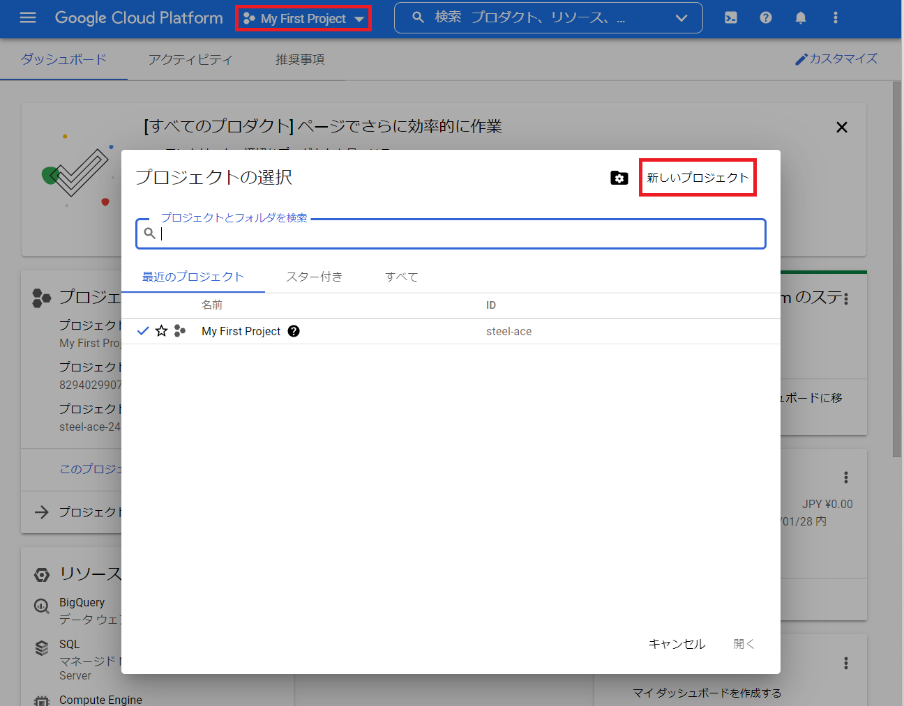

`左上のプルダウン`をクリック後、`新しいプロジェクト`をクリック

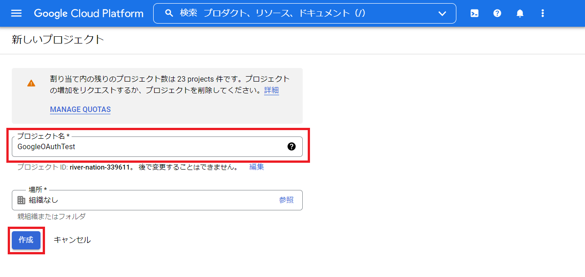

`プロジェクト名`を適当に決めて、`作成`

## 2. 認証情報作成

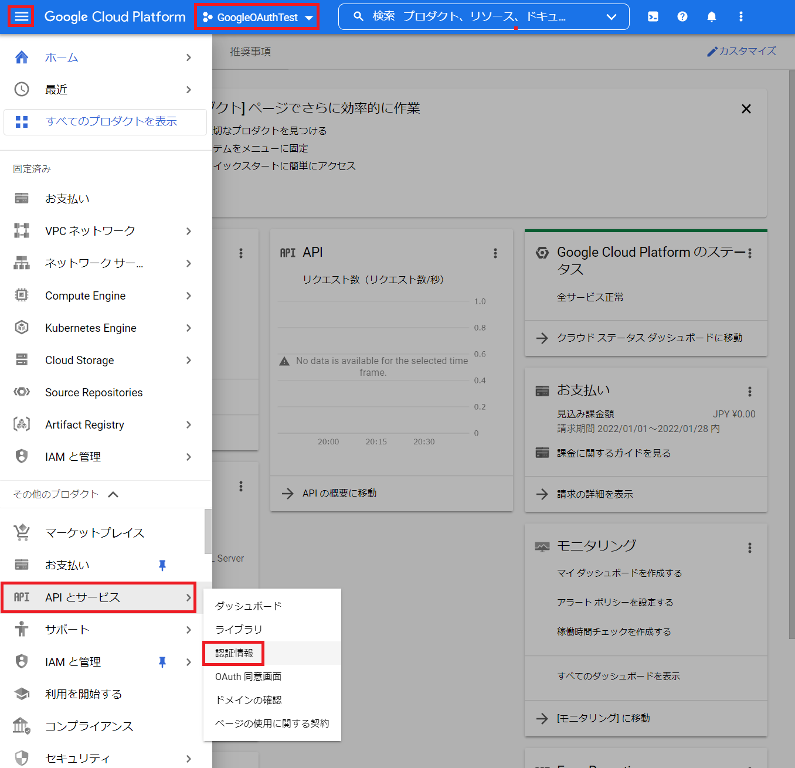

`左上のプルダウン`が作成したプロジェクトにかわってることを確認して、  
`左上のバーガーメニュー`から`APIとサービス`、その中の`認証情報`をクリック

- 同意画面作成

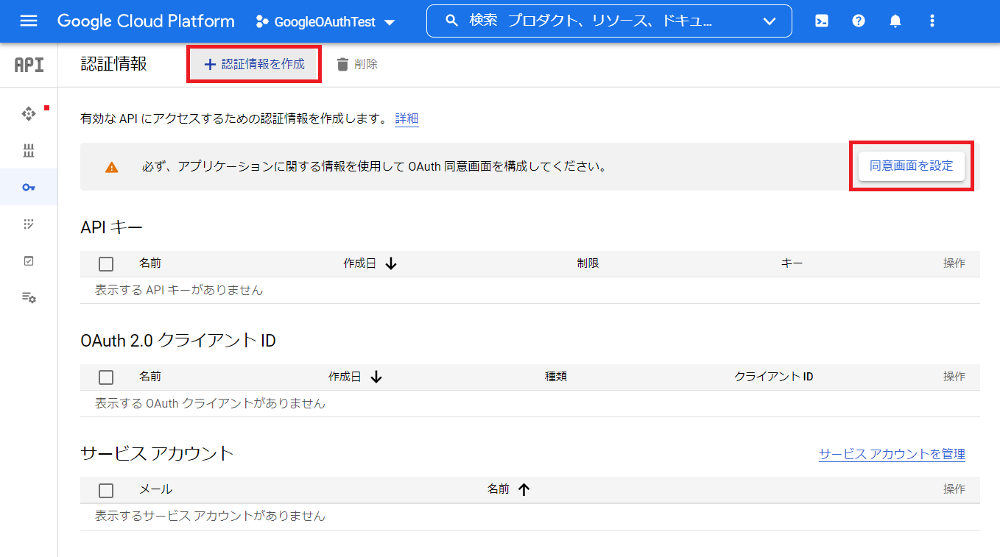

`認証情報`は同意画面を作成しないと作れないので、  
`同意画面を設定`を先にクリック

この同意画面というのは、Googleログインボタンを押したときに出てくる↓のような画面のことです

では同意画面の設定をすすめましょう

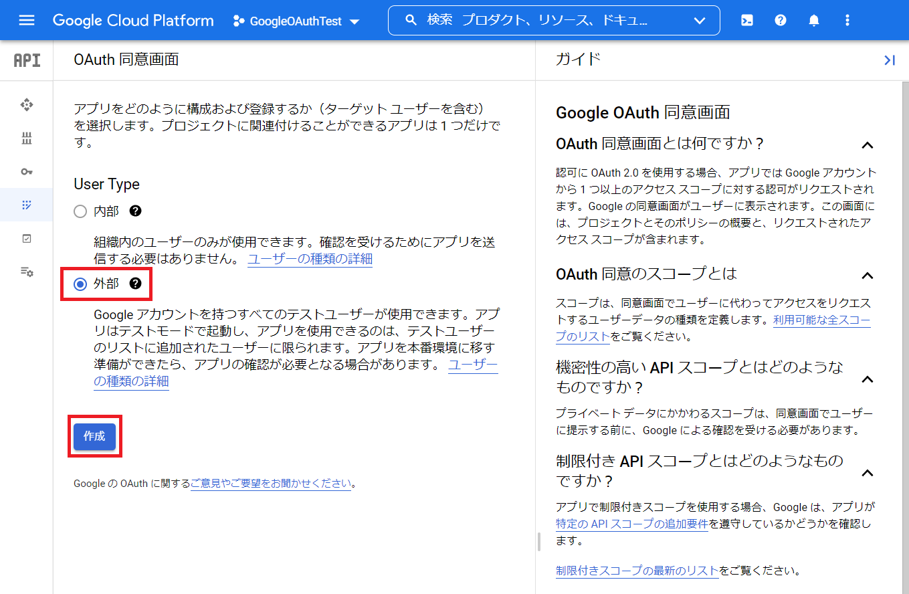

外部のユーザを受け付ける想定なので、`外部`を選択して`作成`

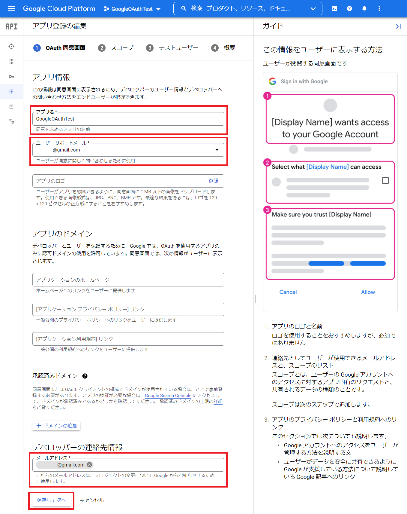

`アプリ名`, `ユーザーサポートメール`, `デベロッパーの連絡先情報 メールアドレス`が必須項目なので埋めます

- アプリ名 : 先ほど例示した同意画面で表示されるアプリ名になります

埋めたら`保存して次へ`

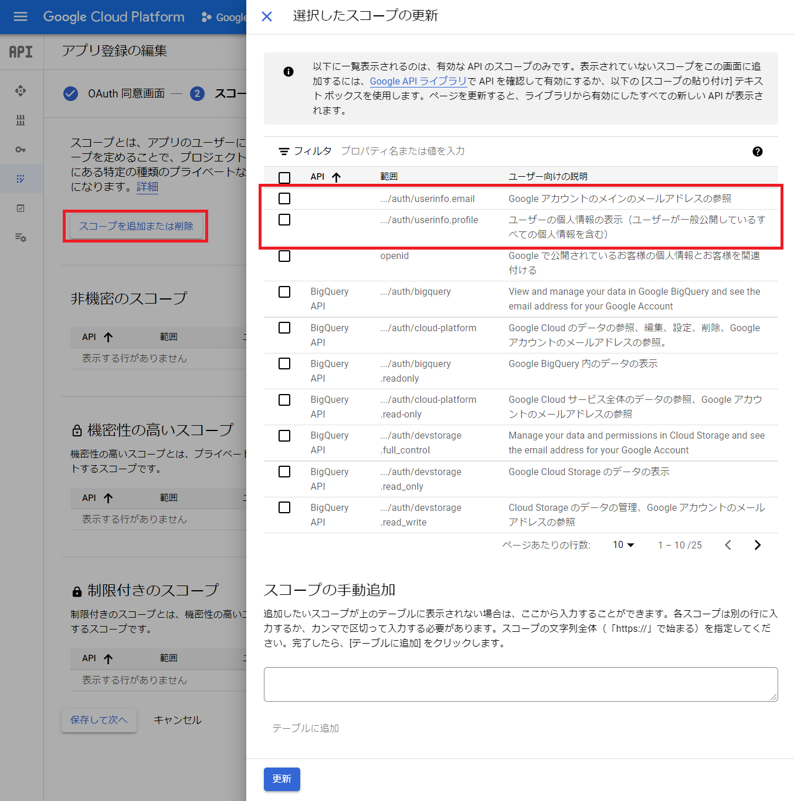

このページ以降、特別な設定は行わないのですべて`保存して次へ`でOKです

スコープに関してだけ、  
`スコープを追加または削除`ボタンを押すと、画像右のようなメニューが出てきます  
このスコープは、アプリがログインするユーザのどの情報にアクセスできるかを決めるものです  
よく、`「○○」が「××」へのアクセスを求めてます`って出てきますよね。あれの`「××」`の部分です。

このチュートリアルでは、**DjangoRESTframework側**で`userinfo.email`,`userinfo.profile`を許可するように設定するので、  
ここでは設定せずに`保存して次へ`に進んでOKです

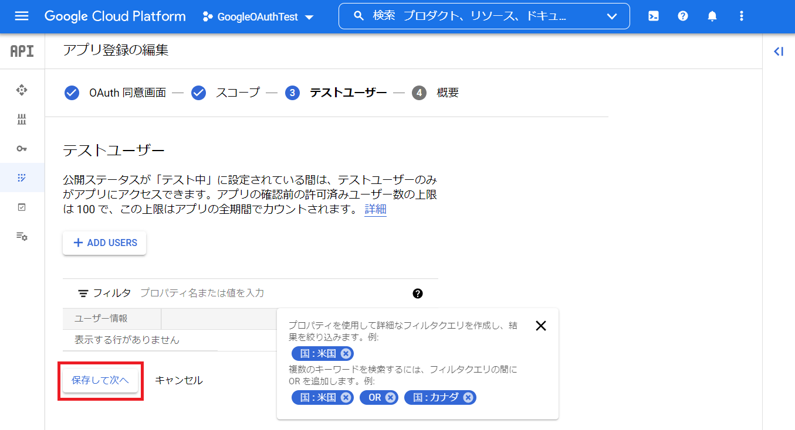

先述したように、何もせず`保存して次へ`でOK

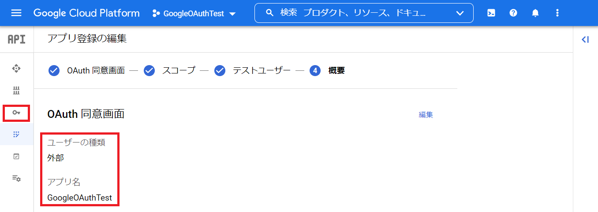

完了です  
設定内容を確認したら、続いて認証情報を作成します  
左メニューの`鍵マーク`をクリック

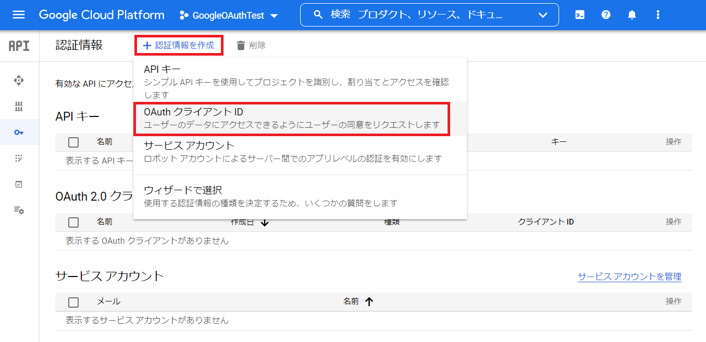

画面上の`認証情報を作成`から、`OAuthクライアントID`をクリック

`アプリケーションの種類`, `名前`, `承認済みのJabaScript生成元`, `承認済みのリダイレクトURI`を埋めます

- アプリケーションの種類 : `ウェブ アプリケーション`を選択します  
- 名前 : OAuth同意画面と同じにしておきます 注意書きにある通りエンドユーザには関係のない部分なので適当でいいでしょう  
- JS生成元 : `http://localhost:3000` (= React プロジェクト) を指定します
- リダイレクトURI : こちらも `http://localhost:3000` を指定します

入力したら`作成`

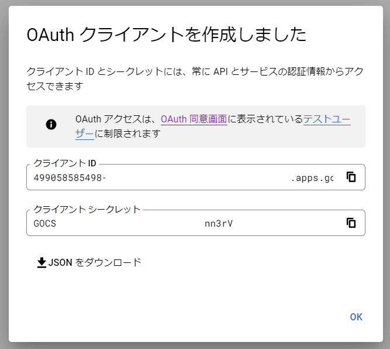

これにて認証情報が作成されました！  
このあとこの認証方法を使ってReact,DRFでやりとりします  
JSONをDLするか、クライアントIDとシークレットをメモ帳に保存しておきます

# Part1 終了

お疲れ様です  
[次のPart](./part2.md)でバックエンドの設定を行います