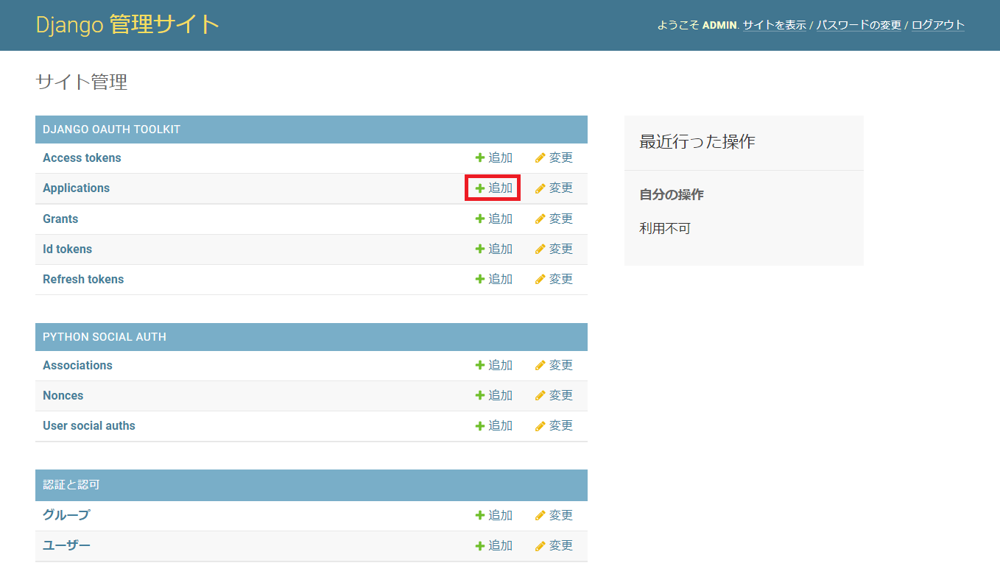
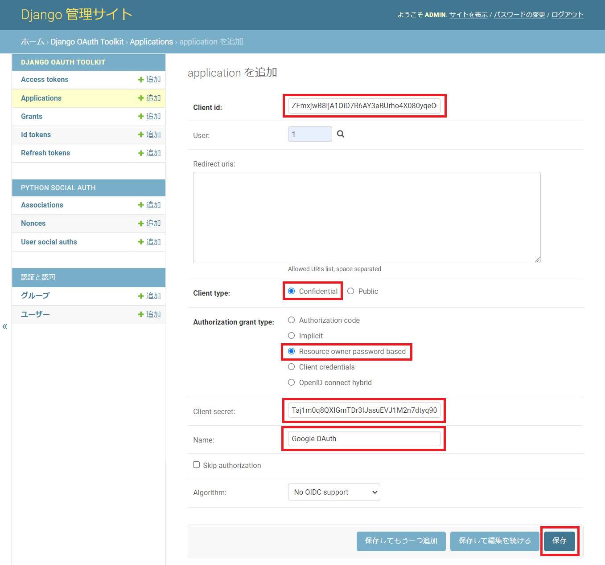
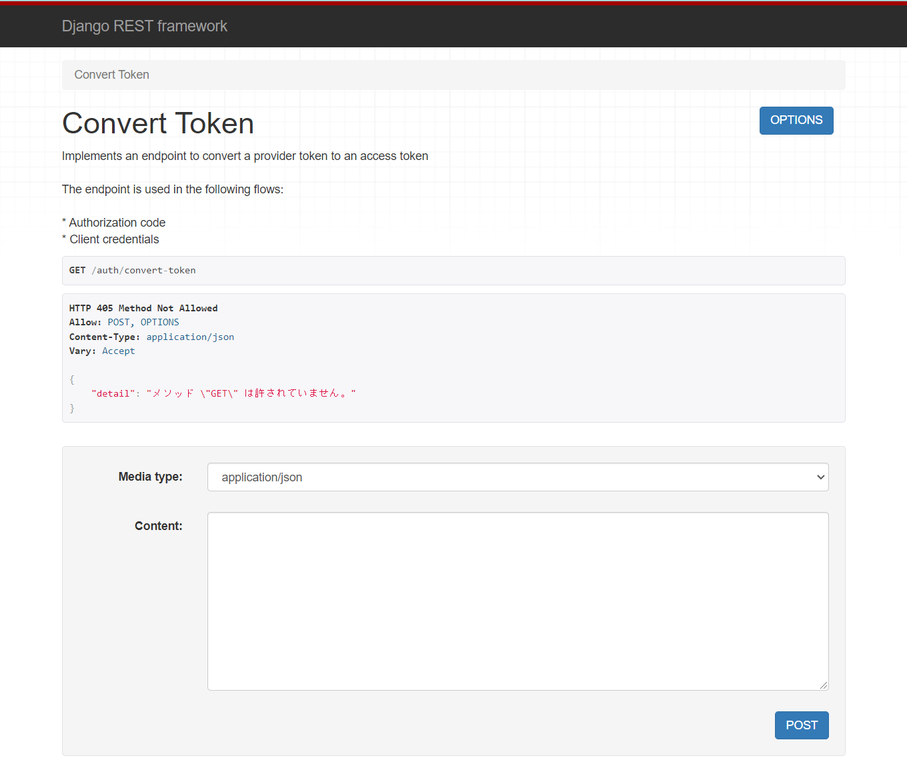

# Part2. バックエンド作成

## 0. 流れの理解

このパートの流れは以下の通りです。

1. 仮想環境作成
2. ライブラリインストール
3. Djangoプロジェクト作成
4. プロジェクトの設定変更
5. 変数設定ファイル作成
6. url作衛
7. 初回migrate,superuser作成
8. django-social-oauth Application作成
9. DRF確認

## 1. 仮想環境作成

```shell
$ python -m venv tutorial
$ source tutorial/bin/activate
$ pip install --upgrade pip
```

## 2. 必要ライブラリインストール

- requirements.txtに記入

```shell
$ vi requirements.txt
```

```txt:requirements.txt
django
djangorestframework
drf_social_oauth2
python-decouple
django-cors-headers
```

drf_social_oauth2 : DRFでOAuth2の機能を利用するために必要  
python_decouple : .envファイルからデータを取り出すときに必要  
django-cors-headers : reactとの連携に必要

- install実行

```shell
$ pip install -r requirements.txt

$ pip list
Package                Version
---------------------- --------
Deprecated             1.2.13
Django                 3.2.11
django-cors-headers    3.10.1
django-oauth-toolkit   1.7.0
djangorestframework    3.13.1
drf-social-oauth2      1.2.1
python-decouple        3.5
```

## 3. プロジェクト作成

```shell
$ django-admin startproject backend
$ cd backend
```

## 4. プロジェクト設定

- INSTALLED_APPS に ライブラリを追加

```py:backend/settings.py
# Application definition

INSTALLED_APPS = [
    'django.contrib.admin',
    'django.contrib.auth',
    'django.contrib.contenttypes',
    'django.contrib.sessions',
    'django.contrib.messages',
    'django.contrib.staticfiles',

    # 以下追加
    'rest_framework',
    'drf_social_oauth2',
    'social_django',
    'oauth2_provider',
    'corsheaders',
]
```

- MIDDLEWARE にも追加

```py:backend/settings.py
MIDDLEWARE = [
    'django.middleware.security.SecurityMiddleware',
    'django.contrib.sessions.middleware.SessionMiddleware',
    'django.middleware.common.CommonMiddleware',
    'django.middleware.csrf.CsrfViewMiddleware',
    'django.contrib.auth.middleware.AuthenticationMiddleware',
    'django.contrib.messages.middleware.MessageMiddleware',
    'django.middleware.clickjacking.XFrameOptionsMiddleware',

    # 以下追加
    'corsheaders.middleware.CorsMiddleware',
]
```

- CORS 設定追記

```py:backend/settings.py
# React との CORS の設定

CORS_ALLOWED_ORIGINS = [
    "http://localhost:3000" # Reactはport:3000を利用
]
```

- TEMPLATES を以下の通り追加

```py:backend/settings.py
TEMPLATES = [
    {
        'BACKEND': 'django.template.backends.django.DjangoTemplates',
        'DIRS': [],
        'APP_DIRS': True,
        'OPTIONS': {
            'context_processors': [
                'django.template.context_processors.debug',
                'django.template.context_processors.request',
                'django.contrib.auth.context_processors.auth',
                'django.contrib.messages.context_processors.messages',

                # 以下追加
                'social_django.context_processors.backends',
                'social_django.context_processors.login_redirect',
            ],
        },
    },
]
```

- REST framework 設定を追加

```py:backend/settings.py
# REST framework 設定

REST_FRAMEWORK = {
    'DEFAULT_AUTHENTICATION_CLASSES': (
        'oauth2_provider.contrib.rest_framework.OAuth2Authentication',
        'drf_social_oauth2.authentication.SocialAuthentication',
    ),
}

AUTHENTICATION_BACKENDS = (
    'drf_social_oauth2.backends.DjangoOAuth2',
    'django.contrib.auth.backends.ModelBackend',
)
```

- さらに、Google OAuth 関連設定追加

```py:backend/settings.py
# decouple から config をインポート
from decouple import config

# Google から取得した鍵情報

SOCIAL_AUTH_GOOGLE_OAUTH2_KEY = config("SOCIAL_AUTH_GOOGLE_OAUTH2_KEY")
SOCIAL_AUTH_GOOGLE_OAUTH2_SECRET = config("SOCIAL_AUTH_GOOGLE_OAUTH2_SECRET")

# アクセススコープの設定

SOCIAL_AUTH_GOOGLE_OAUTH2_SCOPE = [
    'https://www.googleapis.com/auth/userinfo.email',
    'https://www.googleapis.com/auth/userinfo.profile',
]
```

- (オプション)言語設定

なにかと見やすいので日本語化しておく

```py:backend/settings.py
# Internationalization
# https://docs.djangoproject.com/en/3.2/topics/i18n/

LANGUAGE_CODE = 'ja'

TIME_ZONE = 'Asia/Tokyo'
```

## 5. 変数設定ファイル作成

GoogleCloudで取得した認証情報のID,シークレットを変数として保存します  
.envファイルを作成しましょう

※プロジェクトのルート(manage.py と同じ階層)に作成します

```shell:backend
$ vi .env
```

```:.env
SOCIAL_AUTH_GOOGLE_OAUTH2_KEY="499058585498-xxxxxxxxxxxx.apps.googleusercontent.com"
SOCIAL_AUTH_GOOGLE_OAUTH2_SECRET="GOCSxxxxxxxxxxxxnn3rV"
```

## 6. urlの設定

```py:backend/urls.py
from django.contrib import admin
from django.urls import path, include # include追加

urlpatterns = [
    path('admin/', admin.site.urls),
    path('auth/', include('drf_social_oauth2.urls', namespace='drf')), # 追加
]
```

## 7. migrate, superuser作成

```shell
$ python manage.py migrate
$ python manage.py createsuperuser --email=your.email@gmail.com --username=admin
```

## 8. 管理ページ 設定

`http://127.0.0.1:8000/admin` にアクセスし、作成した管理ユーザでログイン

1. Application を作成



Django OAuth Toolkit の Application を追加する

2. 設定



- `Client id` , `Client secret` の値は自動で作成されています 後ほど利用するのでどこかメモ帳に控えておきましょう(※値を変更しないよう注意してください)
- その他以下の通り設定し、保存
  - User : 1
  - Client type : Confidental
  - Authorization grant type : Resource owner password-based
  - Name : 適当に入力(自分はGoogle OAuthにしました)

## 9. DRF確認

`http://127.0.0.1:8000/auth/convert-token` にアクセスしてみて、↓の画面が表示されればいったんOK!



# バックエンド設定完了

[フロントエンド設定へ](./part3.md)