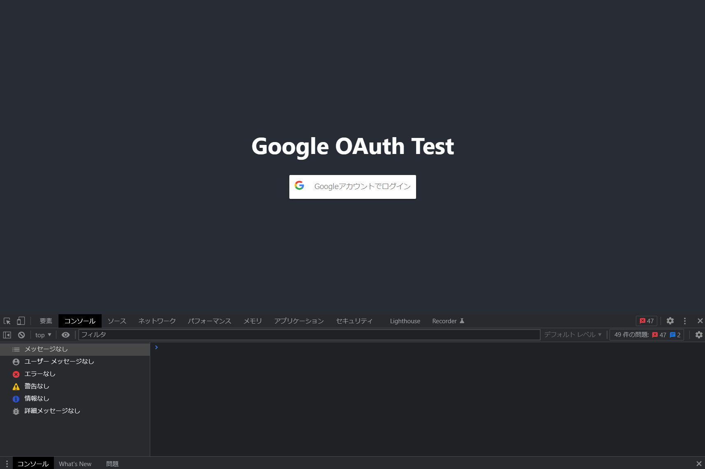
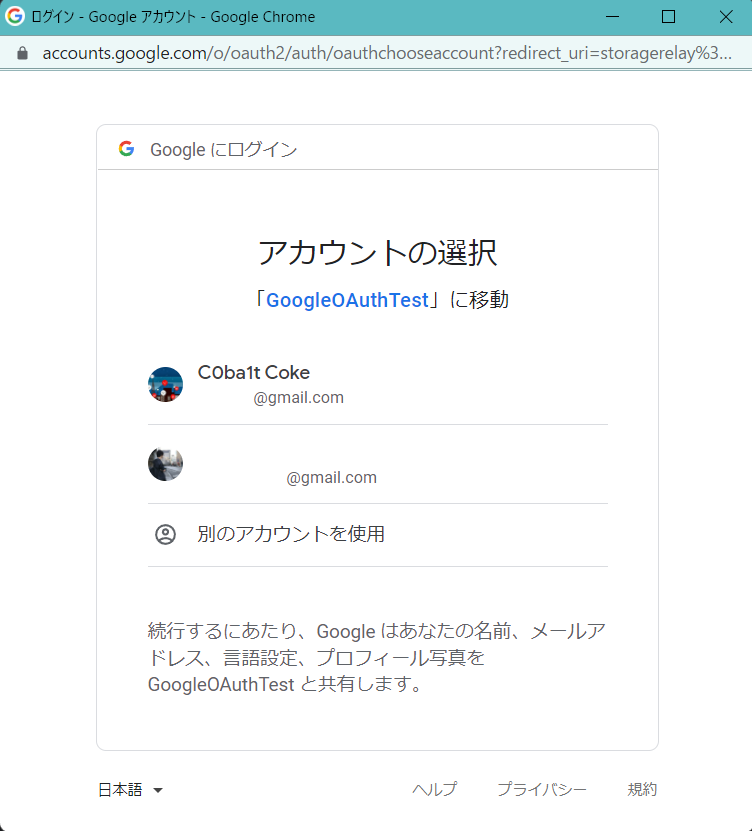
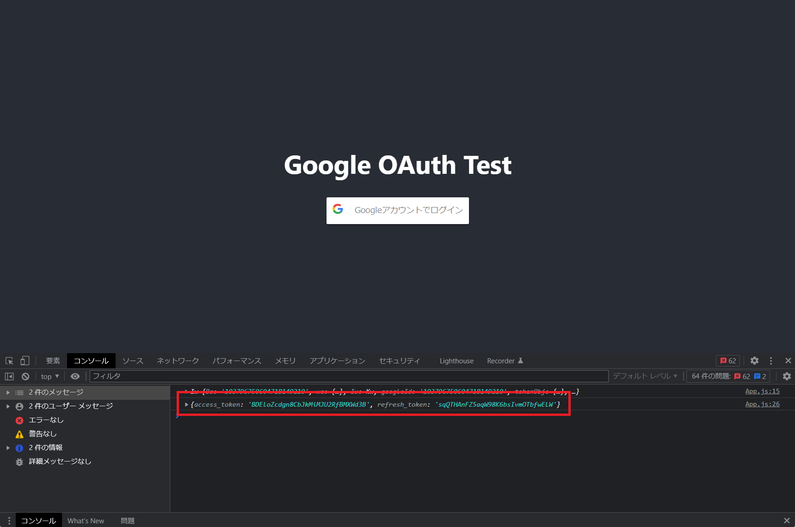
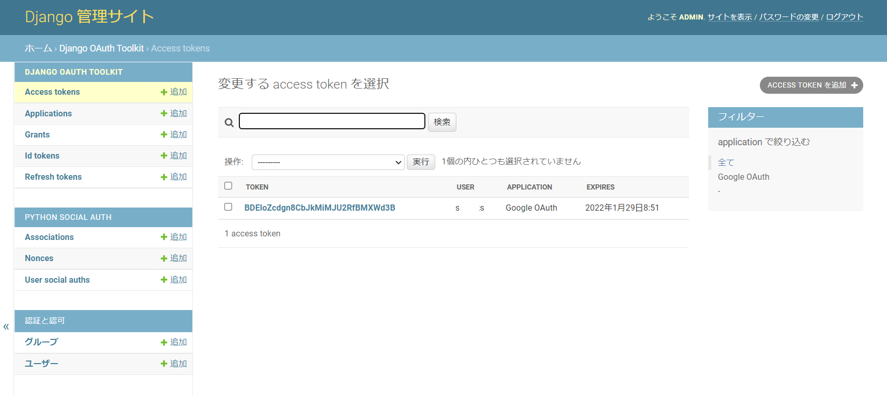
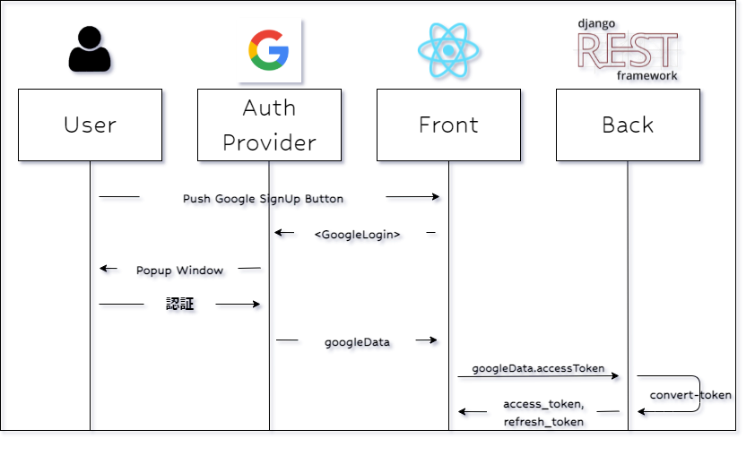

# 【絶対にできる！】Googleログインボタンの実装【3/6】

本記事は、React × DjangoRESTFramework で Googleログインボタン を実装するチュートリアル  
全6partのうちのpart3です  
part1から読む場合は[こちら](./part1.md)  
part0(導入偏)は[こちら](./part0.md)

# Part3. フロントエンド作成

## 0. 流れの理解

このパートの流れは以下の通りです。

1. Reactプロジェクト作成
2. ライブラリインストール
3. 変数設定ファイル作成
4. フロント画面作成
5. 動作確認

[前パート](./part2.md)で起動したDjangoは起動したままにして、  
新しいターミナルを開いて作業します

## 1. React プロジェクト作成

```shell
$ cd ~/
$ npx create-react-app frontend
$ cd frontend
```

## 2. ライブラリインストール

```shell
$ npm i react-google-login axios
```

- react-google-login : ReactでGoogleLogin関連の便利なツールを提供してくれます facebookのやつとかもあるので、余力があれば導入しよう
- axios : HTTPクライアントです DRFのAPIをたたくのに使います fetchでもいいと思います

## 3. .env作成

Google Cloudで発行したOIDC鍵の`CLIENT_ID`と、  
[さっき](./part2#管理ページ)Djangoの管理画面で作成したApplicationに記載されていた`ClientId`,`Client secret`を変数として格納します

```sh
$ vi .env

REACT_APP_GOOGLE_CLIENT_ID=499058585498-xxxxxxxxxxxxx.apps.googleusercontent.com
REACT_APP_DRF_CLIENT_ID=ZEmxjwB8IjA1OiD7R6AY3aBUrho4X080yqeOxxxx
REACT_APP_DRF_CLIENT_RECRET=Taj1m0q8QXlGmTDr3IJasuEVJ1M2n7dxxxx
```

## 4. フロント画面作成

いよいよボタンを画面に表示していきます

- Reactプロジェクト起動

```
$ npm start
```

- ライブラリインポート

```js:App.js
// ライブラリインポート
import GoogleLogin from "react-google-login";
import axios from "axios";
```

- 変数設定

```js:App.js
// .env情報取得
const googleClientId = process.env.REACT_APP_GOOGLE_CLIENT_ID;
const drfClientId = process.env.REACT_APP_DRF_CLIENT_ID;
const drfClientSecret = process.env.REACT_APP_DRF_CLIENT_RECRET;
const baseURL = "http://localhost:8000";
```

- ボタン表示

`<GoogleLogin {option} />` で表示する

```js:App.js
function App() {
  return (
    <div className="App">
      <header className="App-header">
        <h1>Google OAuth Test</h1>
        <GoogleLogin
            clientId={googleClientId}
            buttonText="Googleアカウントでログイン"
            onSuccess={(response) => handleGoogleLogin(response)}
            onFailure={(err) => console.log("Google Login failed", err)}
        ></GoogleLogin>
      </header>
    </div>
  );
}
```

- 認証成功時の関数作成(=onSuccess)

App()内に追加していきます

```js:App.js
function App() {

  // 認証成功時の動作
  const handleGoogleLogin = (response) => {
  	console.log(response)
  	axios
    	.post(`${baseURL}/auth/convert-token`, {
      	token: response.accessToken,
      	backend: "google-oauth2",
      	grant_type: "convert_token",
      	client_id: drfClientId,
      	client_secret: drfClientSecret,
    	})
    	.then((res) => {
      	const { access_token, refresh_token } = res.data;
      	console.log({ access_token, refresh_token });
      	localStorage.setItem("access_token", access_token);
      	localStorage.setItem("refresh_token", refresh_token);
    	})
    	.catch((err) => {
      	console.log("Error Google Login", err);
    	})
  }

	return (
    // 略
  );
}
```

/auth/convert-token に googleで発行されたToken情報(=response.accessToken)を載せてPOSTすると、  
DRFが`access_token`と`refresh_token`に変換した値をResponseで返してくれます

返ってきた値はステートに保存した後、コンソールログに出力、  
ローカルストレージにそれぞれ保存するようにします

## 確認



ボタンを押すと、↓のようによく見るGoogleログインのポップアップが出てくる



ユーザを選択して認証



ここで認証が成功して、onSuccess関数が実行される



DRFで変換されたToken情報がコンソールに出てくる

part4で、このトークンを利用してAPIのテストをする予定なので、
ブラウザは閉じないようにするか、返されたトークン内容をどこかにメモしておいてください

流れは以下の図の通りですね



# part3 終了

お疲れ様です

Googleボタン&Google認証によってトークンが返ってくるようになり、  
さらにそのトークンをDRF内の認証に利用できるトークンへと変換することができました

[次のパート](./part4.md)ではこのトークンを利用して、  
実行に認証が必要な関数を作成していきます

# 参考

このpartまでは以下のページを参考にしました

- [Google Login with Django & React](https://iamashutoshpanda.medium.com/google-login-with-django-react-part-1-c189bc69a999)