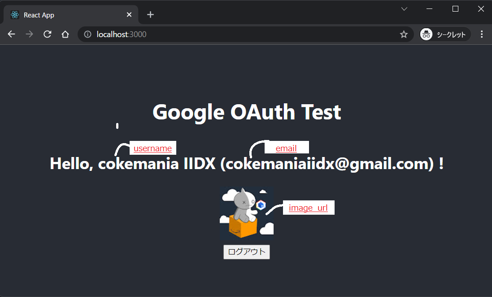
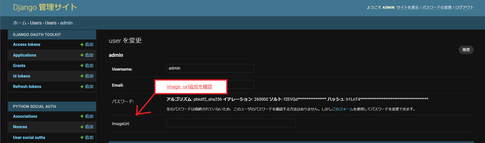
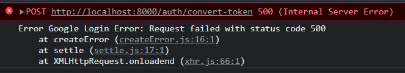

# 【絶対にできる！】Googleログインボタンの実装【5/6】

本記事は、React × DjangoRESTFramework で Googleログインボタン を実装するチュートリアル  
全6partのうちのpart5です  
part1から読む場合は[こちら](./part1.md)  
part0(導入偏)は[こちら](./part0.md)

# Part5. ユーザ登録

## 0. 流れの理解

このパートの流れは以下の通りです。

1. カスタムユーザモデルの作成
2. Serializer,ViewSet作成
3. ユーザ登録用エンドポイントを作成
4. 登録APIを叩くフロントの関数作成


## 1. カスタムユーザモデルを作る(Django)

デモアプリでは、ログインした際にユーザの

- ユーザ名
- email
- トップ画像のURL

を表示します



ただし、デフォルトのユーザモデルでは`ユーザの画像のフィールド`がないため、  
カスタムユーザモデルを作成します

- settings.py追記

カスタムユーザモデルを利用するようにsettings.pyに設定を追加します

```py:settings.py
AUTH_USER_MODEL = 'users.CustomUser'
```

- models.py

[以前のpart](./part4.md)で作成したusersのmodels.pyを作成していきます  
image_urlというフィールドを作成します

```py:users/models
from django.db import models
from django.utils import timezone
from django.contrib.auth.models import AbstractBaseUser,PermissionsMixin,BaseUserManager

class CustomUser(AbstractBaseUser, PermissionsMixin):
	email = models.EmailField('email', unique=True, null=True)
	username = models.CharField('username', unique=True, max_length=150)
	image_url = models.URLField('imageUrl', blank=True, max_length=200)
	is_staff = models.BooleanField('is_staff', default=False)
	is_active = models.BooleanField('is_active', default=True)
	date_joined = models.DateTimeField('date_joined', default=timezone.now)

	objects=CustomUserManager()

	USERNAME_FIELD = 'username'
	EMAIL_FIELD = 'email'
	REQUIRED_FIELDS = ['email']

	class Meta:
		verbose_name = "user"
		verbose_name_plural = "users"
```

カスタムユーザモデルを使ってUserを作成するためにはカスタムユーザマネージャも必要です  

```py:users/models.py
class CustomUserManager(BaseUserManager):
	
	use_in_migrations = True

	def _create_user(self, request_data, password, **extra_fields):
		if not request_data['email']:
			raise ValueError('emailを入力してください')
		if not request_data['username']:
			raise ValueError('usernameを入力してください')
		email = self.normalize_email(request_data['email'])
		user = self.model(
			username=request_data['username'],
			email=email,
			image_url=request_data['image_url'],
			**extra_fields
		)
		user.set_password(password)
		user.save(using=self.db)
		return user

	def create_user(self, request_data, password=None, **extra_fields):
		extra_fields.setdefault('is_staff', False)
		extra_fields.setdefault('is_superuser', False)
		return self._create_user(request_data, password, **extra_fields)
	
	def create_superuser(self, username, email, password, **extra_fields):
		extra_fields.setdefault('is_staff', True)
		extra_fields.setdefault('is_superuser', True)
		if extra_fields.get('is_staff') is not True:
			raise ValueError('staffがTrueではないです')
		if extra_fields.get('is_superuser') is not True:
			raise ValueError('is_superuserがTrueではないです')
		if not email:
			raise ValueError('emailを入力してください')
		if not username:
			raise ValueError('usernameを入力してください')
		email = self.normalize_email(email)
		user = self.model(username=username, email=email, **extra_fields)
		user.set_password(password)
		user.save(using=self.db)
		return user

class User():
	# 略
```

- db削除→再度migration

最初に作ったsuperuserはデフォのUserクラスで作成されちゃっててもうどうしようもないので、  
いったんDB削除して作成しなおす

```shell
$ rm -i db.sqlite3
```

再度migrate, superuser作成

```shell
$ python manage.py makemigrations
$ python manage.py migrate

$ python manage.py createsuperuser
```

- drfApplication再登録

DBを消しちゃったので、[part2](./part2.md#管理ページ)で作成した`Application`がなくなってます  
**再作成して、.envファイルの変更を忘れず行いましょう**

また、この操作を実行するとフロントからGoogleログインを行う際に下記のようなエラーに出くわすことがあります

```
oauthlib.oauth2.rfc6749.errors.InvalidClientIdError: (invalid_request) Invalid client_id parameter value. <oauthlib.Request SANITIZED>
```

Reactプロジェクト起動中に変更した場合は変更が反映されてないため、  
いったんReactプロジェクトを停止した後、もう一度`$ npm start`を事項することで回避できます

- (オプション)Adminサイトで確認できるようにする

DRFでは基本的にAPIを介してユーザの作成・変更・削除を行うことになるので、  
adminへの登録は不要といえば不要です

```py:users/admin.py
from django.contrib import admin
from django.contrib.auth.admin import UserAdmin
from django.contrib.auth.forms import UserChangeForm, UserCreationForm
from django.utils.translation import ugettext_lazy as _
from .models import CustomUser

class CustomUserChangeForm(UserChangeForm):
	class Meta:
		model = CustomUser
		fields = '__all__'

class CustomUserCreationForm(UserCreationForm):
	class Meta:
		model = CustomUser
		fields = ('username', 'email',)

class CustomUserAdmin(UserAdmin):
	fieldsets = (
		(None, {'fields': ('username', 'email', 'password', 'image_url')}),
		(_('Permissions'), {
			'fields': (
				'is_active',
				'is_staff',
				'is_superuser',
				'groups',
				'user_permissions'
			)
		}),
		(_('Important dates'), {'fields': ('last_login', 'date_joined')}),
	)

	add_fieldsets = (
		(None, {
			'classes': ('wide',),
			'fields': ('username', 'email', 'password1', 'password2'),
		}),
	)

	change_form = CustomUserChangeForm
	add_form = CustomUserCreationForm
	list_display = ('username', 'email', 'is_staff')
	list_filter = ('is_staff', 'is_superuser', 'is_active', 'groups')
	search_fields = ('email',)
	ordering = ('email',)


admin.site.register(CustomUser, CustomUserAdmin)
```

admin.pyを書き換えた場合はサーバを起動して管理画面を確認してみましょう

```
$ python manage.py runserver
```



## 2. ユーザ登録用エンドポイントを作成する

### URLの作成

ユーザ登録を行う際のAPIのURLを指定・作成します

```py:users/urls.py
from django.urls import path, include
from . import views
from .views import RegisterUser #

urlpatterns = [
		path('verify-token/', views.verifyToken, name='verify-token'),
    path('register/', RegisterUser.as_view(), name='register'), #
]
```

### Viewの作成

URLで指定したように、`RegisterUser`というViewを作成します  
変更箇所が`#`です

```py:users/views.py
from .models import CustomUser #
from django.db import transaction #
from rest_framework import permissions, status, generics #
from rest_framework.decorators import api_view, permission_classes
from rest_framework.response import Response
from google.oauth2 import id_token
from google.auth.transport import requests
from decouple import config
from .serializers import RegisterUserSerializer #

class RegisterUser(generics.CreateAPIView):
    permission_classes = [permissions.AllowAny]
    queryset = CustomUser.objects.all()
    serializer_class = RegisterUserSerializer

    @transaction.atomic
    def post(self, request):
        serializer = RegisterUserSerializer(data=request.data)
        if serializer.is_valid():
            serializer.save()
            return Response(serializer.data, status=status.HTTP_201_CREATED)
        return Response(serializer.errors, status=status.HTTP_400_BAD_REQUEST)

@api_view(['POST'])
@permission_classes([permissions.AllowAny])
	# 略
```

- permission_classes : ユーザ登録は承認されてない状態で行われるはずなので、AllowAnyにします
- generics : ViewSetより細かくメソッドを定義したい場合などはgenericsを使います 公式チュートリアル参照

### Serializerの作成

DRFでユーザの操作(作成,変更,削除...)を行うにはSerializerクラス, ViewSetクラスを作成します  
`users/`配下に`serializers.py`という名前のファイルを新規作成して、↓のように書きます

```py:users/serializers.py
from rest_framework import serializers
from .models import CustomUser

class RegisterUserSerializer(serializers.ModelSerializer):
    class Meta:
        model = CustomUser
        fields = ['id', 'username', 'email', 'image_url']
    
    def create(self, validated_data):
        request_data = validated_data
        return CustomUser.objects.create_user(request_data)
```

viewで、`serializer.is_valid()`でserializerのデータが検証された後、  
serializerのデータが返されます  
返されたデータによってcreate_user関数が動き、ユーザ登録が実行されます

登録関連の機能は[こちらの記事](https://qiita.com/xKxAxKx/items/60e8fb93d6bbeebcf065)で紹介されているものを参考にさせてもらいました

### APIを試す

ここまで出来たらUser登録がhttpリクエストでできるようになるはずです！

```shell
$ http POST http://127.0.0.1:8000/register/ username="new_user114514" email="tadokoro@swimclub.com" image_url="https://lh3.googleusercontent.com/happinesskiss.png"

HTTP/1.1 201 Created
Allow: POST, OPTIONS
Content-Length: 135
Content-Type: application/json
Date: Sat, 05 Feb 2022 22:04:40 GMT
Referrer-Policy: same-origin
Server: WSGIServer/0.2 CPython/3.6.8
Vary: Accept, Origin
X-Content-Type-Options: nosniff
X-Frame-Options: DENY

{
    "email": "tadokoro@swimclub.com",
    "id": 20,
    "image_url": "https://lh3.googleusercontent.com/happinesskiss.png",
    "username": "new_user114514"
}
```

201(created)レスポンスが返ってきましたね！ HTTPリクエストによる登録まではできました

## 4. フロントでAPIを叩く

フロントの関数を作っていきます  
以下のフローを思い出してください


`ボタン押す`  
→`Google認証情報が返ってくる`  
→`tokenIdをデコード`  
→`登録エンドポイントを叩く`

### ボタンとボタンを押したときの処理作成

少しずつ作っていきましょう  
まずはボタンを表示します

```js:App.js
  const handleGoogleLogin = async (googleData) => {
    // 略
	}

  const handleGoogleSignUp = async (googleData) => {
		console.log(googleData)
	}

  return (
    <div className="App">
      <header className="App-header">
        <h1>Google OAuth Test</h1>
        <div>
          <GoogleLogin
            clientId={googleClientId}
            buttonText="Googleアカウントでログイン"
            onSuccess={(response) => handleGoogleLogin(response)}
            onFailure={(err) => console.log("Google Login failed", err)}
          />
          <hr/>
          <GoogleLogin
            clientId={googleClientId}
            buttonText="Googleアカウントで登録"
            onSuccess={(response) => handleGoogleSignUp(response)}
            onFailure={(err) => console.log("Google SignUp failed.", err)}
          />
				</div>
      </header>
    </div>
  );
}
```


### デコード

ボタンができたら、ユーザのGoogleデータをデコードしてユーザ名とメールアドレス、プロフ画像を拝借します

```js:App.js
  const handleGoogleSignUp = async (googleData) => {
		console.log(googleData)
    
    // tokenIdをデコード
		const userJWT = googleData.tokenId
		const userDetail = await verifyToken(userJWT)
		console.log(userDetail)
	}
```

ここまではログインと同じですね

### 登録エンドポイントを叩く

App()内に関数(registerUser)を追加します

```js:App.js
  const registerUser = async (user_data) => {
    console.log(user_data)
    const username = user_data['name']
    const email = user_data['email']
    const image_url = user_data['picture']
    console.log(username, email, image_url)
    return await axios
      .post(`${baseURL}/register/`, {
          username: username,
          email: email,
          image_url: image_url
        },
      )
      .then((res) => {
        const { username, email, image_url } = res.data;
				return { username, email, image_url }
      })
      .catch((err) => {
        console.log("Error Regigster User", err)
      })
  }

	const handleGoogleLogin = async (response) => {
		// 略
	}

	const handleGoogleSignUp = async (googleData) => {
		console.log(googleData)

    // tokenIdをデコード
		const userJWT = googleData.tokenId
		const userVerifiedData = await verifyToken(userJWT)
		const status = await registerUser(userVerifiedData)
		console.log(status)
	}
```

これでGoogle認証→tokenデコード→ユーザ登録まで完了します  
コンソールに201CREATEDが返ってくることが確認出来たら、  
adminサイトでもユーザが作成されているか確認してみてください


### 登録なのに`<GoogleLogin>`?

ここまで、登録ボタンを作りました  
ログインボタンを押してみた方は、今まで問題なかったのにエラーが出るようになっていることが分かると思います



_↑convert-tokenができなくなってる_

これに関しては、[part1](./part1.md)で`settings.py`に設定した`drf_social_oauth2`が関係してきます

[drf_social_oauth2](https://github.com/wagnerdelima/drf-social-oauth2)は[python social auth](https://python-social-auth.readthedocs.io/en/latest/)を継承しており、  
その`python social auth`の`pipeline`という機能で、**ユーザの新規登録がデフォルトで備わっています**

登録機能なのに<Google**Login**>だったのはこのためですね

ただし、python social authデフォルトの登録機能ですが、**Djangoデフォルトのユーザモデルしか対応していません**
今はすでにカスタムユーザモデルに変更したので、未登録時にログインボタンを押すと下記エラーが出ると思います

```
  File "/home/coke/tutorial/lib64/python3.6/site-packages/social_django/storage.py", line 79, in create_user
    user = cls.user_model()._default_manager.create_user(*args, **kwargs)
TypeError: create_user() missing 1 required positional argument: 'request_data'
```

今回は自前でカスタムユーザを作ってそちらで処理したいので、  
この機能は設定を切っておきましょう  
↓のように`settings.py`に追加することで設定をオーバーライドできます

```py:settings.py
# Python Social Auth 設定のオーバーライド

SOCIAL_AUTH_PIPELINE = (
    'social_core.pipeline.social_auth.social_details',
    'social_core.pipeline.social_auth.social_uid',
    'social_core.pipeline.social_auth.auth_allowed',
    'social_core.pipeline.social_auth.social_user',
    'social_core.pipeline.user.get_username',
    # 'social_core.pipeline.user.create_user',
    'social_core.pipeline.social_auth.associate_user',
    'social_core.pipeline.social_auth.load_extra_data',
		'social_core.pipeline.user.user_details',
)
```

`create_user`のメソッドをコメントアウトすることでユーザ登録機能をスキップできます

- 参考 :
  - [DjangoでGoogleログイン認証【メールバリデーション編】](https://tsukasa-blog.com/programming/social-django-email-validation/)
  - [Pipeline-PythonSocialAuthDocumentation](https://python-social-auth.readthedocs.io/en/latest/pipeline.html)

ただし、このままではまだconvert-tokenを実行する際にエラーを起こしてしまいます  
**pipeline上で`user`オブジェクトを作成しないといけないのですが、その作成を担っている`create_user`関数を外してしまったからです**  
このエラーを回避するために、`user作成自体は行わず、userオブジェクトを返すだけの関数`を作成して、**パイプラインに組み込む**必要があります

pipeline上には`独自の関数`を組み込むことができるので、  
下記の通り追加します

```py:settings.py
# Python Social Auth 設定のオーバーライド

SOCIAL_AUTH_PIPELINE = (
    'social_core.pipeline.social_auth.social_details',
    'social_core.pipeline.social_auth.social_uid',
    'social_core.pipeline.social_auth.auth_allowed',
    'social_core.pipeline.social_auth.social_user',
    'social_core.pipeline.user.get_username',
    # 'social_core.pipeline.user.create_user',
    'users.pipeline.login_user', # 追加
    'social_core.pipeline.social_auth.associate_user',
    'social_core.pipeline.social_auth.load_extra_data',
    'social_core.pipeline.user.user_details',
)
```

userアプリ内に`pipeline.py`というファイルを作成します

```py:users/pipeline.py
from .models import CustomUser

def login_user(response, user=None, *args, **kwargs):

    if not user:
        email = response['email']
        username = response['name']
        login_user = CustomUser.objects.get(username=username, email=email)
        return {
            'is_new': False,
            'user': login_user
        }
```

リクエスト内のユーザ情報をもとに、クエリを実行してuserオブジェクトを作成し、returnするようにします  
このあたりについては、[こちら](https://qiita.com/cokemaniaIIDX/items/c8b19fc03189e0995ad1)の記事で詳しく調査したものをまとめたので、気になった方は確認してみてください

ここまで修正できたら`Googleでログイン`ボタンを押してみて、  
ユーザの情報がJSONでコンソールに表示できるようになっていることを確認してみてください

# part5 終了

ユーザ登録機能を実装することができました

しかし、まだユーザ情報が画面に出ない状態なので、  
[次のパート](./part6.md)で登録後の処理を作成していきます