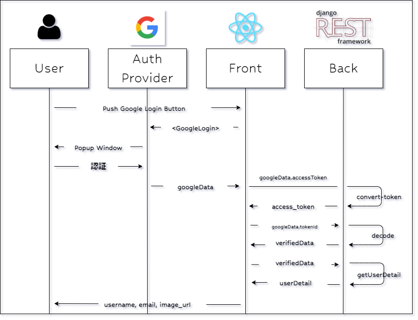
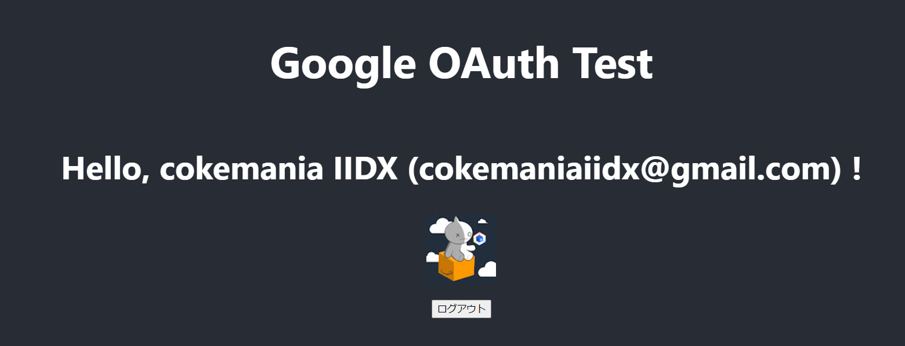

# 【絶対にできる！】Googleログインボタンの実装【6/6】

本記事は、React × DjangoRESTFramework で Googleログインボタン を実装するチュートリアル  
全6partのうちのpart6です  
part1から読む場合は[こちら](./part1.md)  
part0(導入偏)は[こちら](./part0.md)

# part6. ユーザ情報表示

## 0. 流れの理解

このパートの流れは以下の通りです。

1. ユーザ情報を返す関数の作成
2. ユーザ情報をリクエストする関数の作成
3. ユーザ情報の保持
4. ログアウト処理作成



## 1. ユーザ情報を返す関数を作成する(DRF)

ユーザ登録後の処理フローを確認します  
前パートのユーザ登録フローを含めて以下のような感じになります

ボタン押す  
→`Google認証情報が返ってくる`  
→tokenIdをデコード  
→登録エンドポイントを叩く  
→`Google認証の中のaccessTokenをaccess_tokenに変換する`  
→`access_tokenをヘッダにつけてユーザデータを返すエンドポイントを叩く`  
→`フロントでユーザ情報を表示`  

### Serializer & APIView & url を作成

ではDjangoDBに保存されているユーザ情報を取得する関数を作成します  
まずserializers.pyを開いて以下の通り`UserSerializer`を追加します

```py:users/serializers.py
from rest_framework import serializers
from .models import CustomUser

class UserSerializer(serializers.HyperlinkedModelSerializer):
	class Meta:
		model = CustomUser
		fields = ['username', 'email', 'image_url']

class RegisterUserSerializer(serializers.ModelSerializer):
    # 略
```

続いてviews.pyを↓の通り作成します

```py:users/views.py
from .models import CustomUser
from django.db import transaction
from rest_framework import permissions, status, generics
from rest_framework.views import APIView #
from rest_framework.decorators import api_view, permission_classes
from rest_framework.response import Response
from google.oauth2 import id_token
from google.auth.transport import requests
from decouple import config
from .serializers import RegisterUserSerializer, UserSerializer #

class GetUserDetail(APIView):
    permission_classes = [permissions.IsAuthenticated,]
    def  get(self, request):
        serializer = UserSerializer(request.user)
        return Response(serializer.data)

class RegisterUser(generics.CreateAPIView):
	# 略
```

urlを登録します

```py:usrs/urls.py
from django.urls import path, include
from . import views
from .views import RegisterUser, GetUserDetail # 追加

urlpatterns = [
	path('verify-token/', views.verifyToken, name='verify-token'),
    path('register/', RegisterUser.as_view(), name='register'),
    path('get-user-detail/', GetUserDetail.as_view(), name='get-user-detail'), # 追加
]
```

### リクエストヘッダについて

では、ここで作ったAPIのテストをやってみます

```sh
$ http GET http://127.0.0.1:8000/get-user-detail/
HTTP/1.1 401 Unauthorized
Allow: GET, HEAD, OPTIONS
Content-Length: 55
Content-Type: application/json
Date: Fri, 04 Mar 2022 15:00:28 GMT
Referrer-Policy: same-origin
Server: WSGIServer/0.2 CPython/3.6.8
Vary: Accept, Origin
WWW-Authenticate: Bearer realm="api"
X-Content-Type-Options: nosniff
X-Frame-Options: DENY

{
    "detail": "認証情報が含まれていません。"
}
```

はい `401(Unauthorized)コード, 認証情報が含まれていません` と返ってきましたね

これはなぜかというと、  
getUserDetail()の`permission_class`を**IsAuthenticated**にしたためです  
part4ではさらっと飛ばしちゃいましたが、  
これは、getUserDetail()に対して操作(GET)を行えるのが、`認証されたユーザのみ`ということになります  

ではどうやって認証された状態でリクエストを送れるのか、、、  
ここで`convert-token`で発行た`access_token`を使うわけですね！

access_tokenってなんだっけ、、ってなった方は[part4](./part4.md)を見返してみてください

get-user-detail/ に対して、Authorizationヘッダにトークンを付与して送るとそのリクエストユーザのデータが返ってきます  
httpieで確認してみましょう

```shell
$ http GET http://127.0.0.1:8000/get-user-detail/ "Authorization: Bearer <access_tokenを入力>"
HTTP/1.1 200 OK
Allow: GET, HEAD, OPTIONS
Content-Length: 165
Content-Type: application/json
Date: Fri, 04 Mar 2022 15:00:19 GMT
Referrer-Policy: same-origin
Server: WSGIServer/0.2 CPython/3.6.8
Vary: Accept, Origin
X-Content-Type-Options: nosniff
X-Frame-Options: DENY

{
    "email": "cokemaniaiidx@gmail.com",
    "image_url": "https://lh3.googleusercontent.com/a-/AOh14GiU6D56S_YcfRs43Bthda-ob2NFAcBVHU04rfnQ=s96-c",
    "username": "cokemania IIDX"
}
```

part4などで作成したユーザで試してみてください

## 2. ユーザ情報をリクエストする関数を作成する(React)

お次はフロントで先ほど作ったAPIを叩く関数を作成します

```js:App.js
// 忘れずにimportする
import { useState } from 'react';

function App() {

	const [ userDetail, setUserDetail ] = useState("");

	// 略

	const getUserDetail = async (accessToken) => {
		const token = accessToken
		return await axios
			.get(`${baseURL}/get-user-detail/`, {
				headers: {
					Authorization: `Bearer ${token}`,
				}
			})
			.then((res) => {
				const { username, email, image_url } = res.data;
				return { username, email, image_url }
			})
			.catch((err) => {
				console.log("Error Get User Detail", err)
			})
	}

  const handleGoogleLogin = async (googleData) => {

    // ユーザのGoogle:accessTokenをconvertする
		const userAccessToken = googleData.accessToken
		const drfAccessToken = await convertToken(userAccessToken)

    // drfAccessTokenを使ってユーザデータ表示
		const userDetail = await getUserDetail(drfAccessToken)

    // ステート更新
		setUserDetail(userDetail)
	}

  const handleGoogleSignUp = async (googleData) => {
		console.log(googleData)

    // tokenIdをデコード
		const userJWT = googleData.tokenId
		const userVerifiedData = await verifyToken(userJWT)

		// デコードされたユーザ情報で新規登録
		const userRegisteredData = await registerUser(userVerifiedData)
		
    // 新規登録されたユーザのGoogle:accessTokenをconvertする
		const userAccessToken = googleData.accessToken
		const drfAccessToken = await convertToken(userAccessToken)

    // drfAccessTokenを使ってユーザデータ表示
		const userDetail = await getUserDetail(drfAccessToken)

    // ステート更新
		setUserDetail(userDetail)
	}
```

- const [ userDetail, setUserDetail ] = useState(""); : ステートを初期化

- getUserDetail:
  - axios.get:
    - { headers: { Authorization: `Bearer ${token}` }} : token情報を**Authorizationヘッダに付与**するにはこのように書きます
  - .then:
    - resにSerializerデータがレスポンスとして入っているので、その中のusername, email, image_url変数に格納します
    - return で返します

- handleGoogleLogin : ログインボタンを押したときの処理
  - `convertToken`関数実行により、`access_token`がすでに返ってきているので、その後いきなり`getUserDetail()`実行できます
  - 引き出した情報はステートに保存します

- handleGoogleSignUp : 登録ボタンを押したときの処理
  - userDetail = await getUserDetail(drfAccessToken) : convert-tokenによって取得したaccessTokenを渡してgetUserDetail関数を実行します
  - ログイン時と同様、`username`,`email`,`imaga_url`が返ってきているので、それらをUserDetailステートに保存します

## 3. ユーザ情報画面表示

ログイン処理ができたので、ユーザ情報を表示してあげましょう

```js:App.js
function App() {
	const [ userDetail , setUserDetail ] = useState("");

  const convertToken = async (googleData) => {
		// 略
	}

	const verifyToken = async (googleToken, drfToken) => {
		// 略
	}

	const handleGoogleLogin = async (googleData) => {

    // 略
	}

  return (
    <div className="App">
      <header className="App-header">
        <h1>Google OAuth Test</h1>
				{
					userDetail ? (
						<div>
							<h2>Hello, {userDetail.username} ({userDetail.email}) !</h2>
							<br/>
						</div>
					) : (
						<div>
							<GoogleLogin
								clientId={googleClientId}
								buttonText="Googleアカウントでログイン"
								onSuccess={(response) => handleGoogleLogin(response)}
								onFailure={(err) => console.log("Google Login failed", err)}
							/>
							<hr/>
							<GoogleLogin
								clientId={googleClientId}
								buttonText="Googleアカウントで登録"
								onSuccess={(response) => handleGoogleSignUp(response)}
								onFailure={(err) => console.log("Google SignIn failed.", err)}
							/>
						</div>
					)
				}
      </header>
    </div>
  );
}

export default App;
```

ステート`userDetail`の中身があるかどうかで分岐させます  
`{ userDetail ? ( ある時の処理 ) : ( ない時の処理 ) }`で表示切替できます

ステートの中身がない、つまり未ログインの場合は、<GoogleLogin>ボタンを表示させます  
ステートの中身がある、つまりログイン済の場会は、ユーザ名とemail、ユーザのGoogleの登録画像を表示させます

## 4. ユーザ情報を保存

新規登録、ログインまで完成しましたね

今のところブラウザを更新するとデータが蒸発してログイン画面に戻ってしまうので、  
stateの初期値としてローカルストレージに保存されたデータを読み込みます

- stateの初期値を修正

```js:App.js
function App() {
	const [ userDetail, setUserDetail ] = useState(
		localStorage.getItem('userDetail')
		 	? JSON.parse(localStorage.getItem('userDetail'))
		 	: null
	);

...
```

ローカルストレージの中身を見て、値があればそれをuserDetailの初期値として設定します  
無ければ、nullで初期化します

- login,logout処理時にlocalStorageに値を保存

```js:App.js
	const handleGoogleLogin = async (googleData) => {

		// ユーザのGoogle:accessTokenをconvertする
		const userAccessToken = googleData.accessToken
		const drfAccessToken = await convertToken(userAccessToken)

		// drfAccessTokenを使ってユーザデータ表示
		const userDetail = await getUserDetail(drfAccessToken)

		// ステート更新
		setUserDetail(userDetail)

		// LocalStorageに保存
		localStorage.setItem('userDetail', JSON.stringify(userDetail)) // 追加
	}

	const handleGoogleSignUp = async (googleData) => {
 
		// Googleユーザのjwtをデコードする
    const userJWT = googleData.tokenId
    const userVerifiedData = await verifyToken(userJWT)
    
		// デコードされたデータでユーザ登録を行う
		const userRegisteredData = await registerUser(userVerifiedData)

		// 新規登録されたユーザのGoogle:accessTokenをconvertする
		const userAccessToken = googleData.accessToken
		const drfAccessToken = await convertToken(userAccessToken)

		// drfAccessTokenを使ってユーザデータ表示
		const userDetail = await getUserDetail(drfAccessToken)
		
		// ステート更新
		setUserDetail(userDetail)

		// LocalStorageに保存
		localStorage.setItem('userDetail', JSON.stringify(userDetail)) // 追加
	}

	const handleLogout = () => {
		localStorage.removeItem('userDetail')
		setUserDetail(null)
	}
```

これで更新ボタンを押してもログイン状態が維持できるようになりました！

## 5. ログアウト処理の作成

最後にログアウトボタンを作成します

保存していたステートとlocalstorageを削除するボタンを追加するだけです

```js:App.js
	const handleLogout = () => {
		localStorage.removeItem('userDetail')
		setUserDetail(null)
	}

  return (
    <div className="App">
      <header className="App-header">
        <h1>Google OAuth Test</h1>
				{
					userDetail ? (
						<div>
							<h2>Hello, {userDetail.username} ({userDetail.email}) !</h2>
							<br/>
							<button onClick={handleLogout}>ログアウト</button>
						</div>
					) : (
						<div>
							<GoogleLogin
								clientId={googleClientId}
								buttonText="Googleアカウントでログイン"
								onSuccess={(response) => handleGoogleLogin(response)}
								onFailure={(err) => console.log("Google Login failed", err)}
							/>
							<hr/>
							<GoogleLogin
								clientId={googleClientId}
								buttonText="Googleアカウントで登録"
								onSuccess={(response) => handleGoogleSignUp(response)}
								onFailure={(err) => console.log("Google SignIn failed.", err)}
							/>
						</div>
					)
				}
      </header>
    </div>
  );
```

ついに完成、、、！！！



# part6 終了

お疲れさまでした  
これにてGoogle登録・ログインボタンのチュートリアルは終了となります

まだまだ開発しなければならない点も残ってますが、  
(トークンの有効期限処理や登録・ログイン周りのエラーハンドリング)  
Googleログインボタンの作成自体の解説と遠ざかっていくため、ここで解説は終わりにしようかなと思います

ここまで読んでくださりありがとうございます  
開発の参考になれば大変幸いです

# 参考

デモアプリの内容は下記動画で紹介されている方法を参考に、React×DRFでできるようにアレンジしました

[React Google Login Tutorial: Build React.js App To Login With Google](https://www.youtube.com/watch?v=75aTZq-qoZk&list=LL&index=1&t=1293s)

めちゃくちゃ参考になりました 正直この動画が無かったらぶん投げて諦めてましたｗ